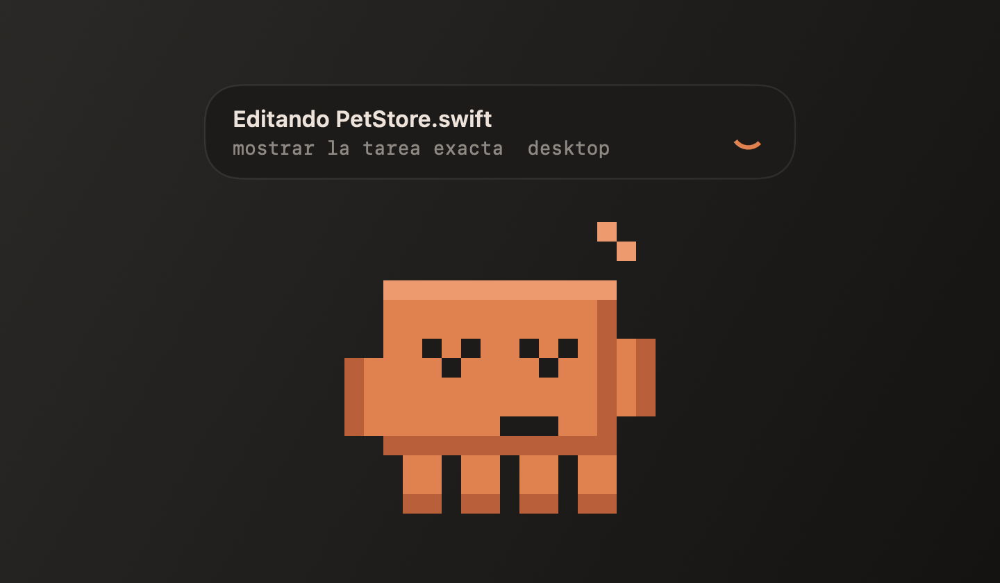
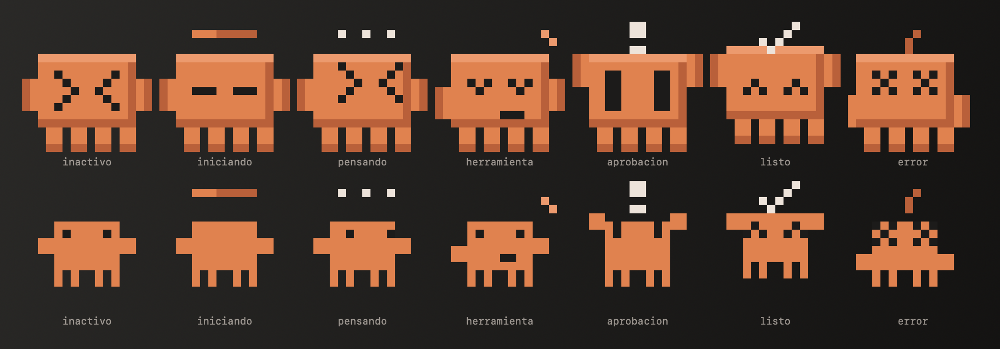
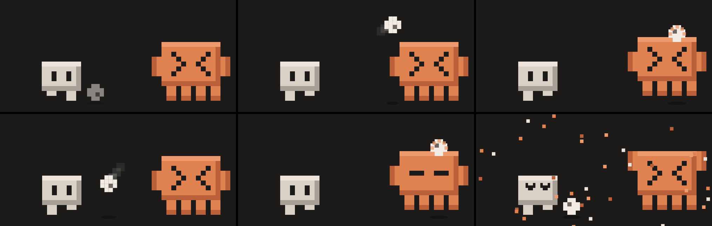
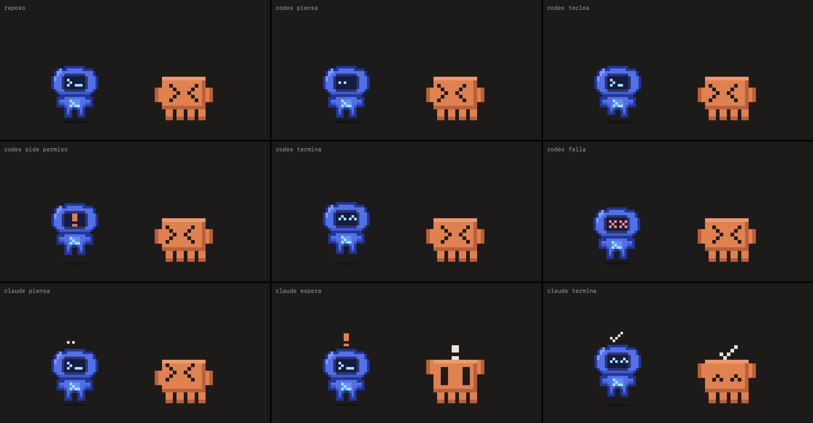

# claude pet

windows: [frontend inicial e instalación](windows/README.md), con mascota de claude y hooks locales. la versión de macos mantiene las funciones completas descritas abajo.

dos mascotas pixel-art para macos, una por herramienta: claude code y codex. cada una es una ventana independiente que aparece cuando usas su herramienta y muestra en tiempo real lo que hace. swiftui puro, sin dependencias, todo local.

pagina: https://kisnner26.github.io/claude-pet/



## que hace

- una mascota por herramienta: la de claude aparece si usas claude code (la app abierta o una sesion con hooks) y la de codex si usas codex (la app abierta o su adaptador en el pet bus). si usas una, sale una; si usas las dos, salen las dos. se desactiva desde el menu.
- son entidades separadas: cada una se arrastra por su cuenta, recuerda su posicion y su clic abre su app.
- el visor de codex muestra su estado real: reposo, pensando (puntos), herramienta (teclea), permiso (`!` naranja), listo (`^ ^`) y error (`x x`). al arrastrarlo alterna los pies; reaccionan entre si, se saludan, se aplauden y juegan al futbol aunque esten en lados distintos de la pantalla.
- codex tiene su propio panel: tres aspectos, gestos automáticos y acciones manuales (saludar, saludo formal, celebrar, curiosidad y patrullar). cuando claude no está en uso, el panel pasa a modo solo; cuando ambos trabajan cerca, activa modo dúo con paquetes visuales entre las ventanas.
- refleja el estado real de claude code: inactivo, iniciando, pensando, ejecutando herramienta, esperando tu aprobacion, listo y error.
- la burbuja de actividad sirve a las dos: la de claude dice la tarea exacta y la de codex solo su estado (por el pet bus no llega ningun detalle); se ancla a la mascota que esta trabajando.
- una burbuja sobre la mascota dice la tarea exacta: "editando PetStore.swift", la descripcion del comando que corre, la tarea en curso.
- dos aspectos (bloque y clasico). el icono de la barra de menu cambia segun lo que usas: la silueta de claude, la de codex o las dos juntas.
- abrazo automatico: si las dos mascotas estan juntas (menos de 56 px entre ventanas), a la misma altura y ambas tranquilas (en reposo o recien terminadas), se abrazan: comparten suelo y cada una rodea con un brazo el cuerpo de la otra. se corta si una trabaja, pide permiso o falla, para no esconder su estado, y respeta "reducir movimiento".
- clic abre la app de claude. se arrastra por toda la pantalla.
- aviso de contexto: si el proyecto cambia mientras claude piensa, la burbuja avisa para que revises el diff. opcional (apagado por defecto): bloquear la siguiente herramienta hasta tu proximo mensaje.
- detector de atasco: avisa si claude o codex llevan 5 min pensando o 15 min en una herramienta sin ninguna actividad.
- cuando codex termina en un proyecto donde claude sigue trabajando, el menu ofrece abrir el diff.

## mission control

cinco funciones locales convierten la mascota en un tablero operativo:

- radar de colision: marca una posible colision cuando ambos llevan 10 s pensando o usando herramientas en un proyecto compartido. compara solo el nombre de la carpeta, ignora nombres genericos y tarda 5 s en apagarse; no pretende detectar ramas ni worktrees distintos con el mismo nombre.
- pulso git: muestra archivos afectados, staged, nuevos y conflictos sin leer su contenido. escanea al cambiar de proyecto, terminar, fallar, quedar inactivo o cada 15 s mientras trabaja; nunca ejecuta mas de un `git status` y conserva como maximo una solicitud pendiente.
- linea de tiempo: conserva en memoria los ultimos 16 cambios de estado de ambos agentes, con su hora.
- presupuesto de atencion: mide duracion, cantidad de herramientas usadas y las tres mas frecuentes. el ultimo resumen permanece visible al terminar.
- capsula de recuperacion: si el estado agregado permanece en error al menos 3 s, conserva la salud git del proyecto que fallo y ofrece abrir su diff. claude pet no distingue por si solo un `StopFailure` de otros errores agregados.

el pulso git usa `--no-optional-locks`, no permite prompts y corta cada proceso a los 10 s. limita la salida a 4 mb; ante ese limite o mas de 20 000 registros repite el estado sin archivos no rastreados y lo indica en el menu.

ninguno de estos datos cruza el pet bus ni se persiste entre ejecuciones.



## pet bus y futbol

las mascotas se descubren entre si por sockets unix locales (`~/.claude-pet/bus/`, protocolo json v1). cada mascota es una ventana propia. si se ven las dos, estan a menos de 640 px y llevan unos segundos inactivas, juegan un partido breve: una capa transparente une a las dos y la pelota viaja de la ventana de codex a la de claude, sin mover ninguna. si ambas trabajan, la misma capa cambia a modo dúo y muestra paquetes azul/terracota, sin enviar datos nuevos. se cancela al instante si alguna trabaja, respeta "reducir movimiento" y se puede disparar a mano.





protocolo y guia para el adaptador de codex en [docs/PET-BUS.md](docs/PET-BUS.md).

## como funciona

```
claude code --hook--> hooks/pet-hook.sh --socket unix 0600--> ClaudePet.app
```

el script traduce 10 eventos de hook a un estado y lo manda por un socket local. no hay red, ni credenciales, ni telemetria.

## privacidad

- solo sockets unix del mismo usuario (carpeta 0700, socket 0600).
- el detalle de la burbuja es local y nunca sale por el pet bus: descripcion del comando, nombre del archivo (no la ruta), programa de un comando (nunca sus argumentos), host de una url y tu ultimo mensaje.
- se apaga desde el menu. el nombre del proyecto no se comparte con otras mascotas salvo que lo actives.
- el detector de contexto solo calcula una huella local de nombres, fechas y tamanos de archivos; no lee contenido. ignora `.git`, dependencias, builds y logs.
- la ruta del proyecto llega a la app por el socket local (para la huella y el diff). no se muestra, no se escribe a disco y no cruza el pet bus: ahi solo va el nombre de la carpeta, y solo si lo activas.
- mission control mantiene rutas, rama, contadores, linea de tiempo y capsulas solo en memoria. ninguno se serializa en el pet bus.
- el hook no bloquea nada salvo que actives "bloquear herramientas si el proyecto cambia". la marca caduca a los 10 min y se borra con tu siguiente mensaje o al cerrar la sesion.

## instalacion

requiere macos 13+, command line tools y `jq`.

```sh
./build.sh                     # compila build/ClaudePet.app (firma ad-hoc)
open build/ClaudePet.app
./install-hooks.sh --dry-run   # muestra el diff exacto de ~/.claude/settings.json
./install-hooks.sh             # lo aplica tras pedir confirmacion, con copia de respaldo
```

abre una sesion nueva de claude code para que cargue los hooks. no pide permisos del sistema: escribe solo en `~/.claude-pet/` y, al instalar, fusiona sus hooks en `~/.claude/settings.json` sin tocar los tuyos. si macos bloquea la app (firma ad-hoc): clic derecho, abrir.

## pruebas

```sh
tests/manual.sh              # recorre cada estado
tests/bridge-capture.sh      # comprueba que el hook no filtra contenido
tests/hook-guard.sh          # el hook no bloquea por defecto; bloqueo opt-in, caducidad, clasificacion de pruebas
build/ClaudePet.app/Contents/MacOS/ClaudePet --selftest-safety   # huella, monitor, diff grande, parseo
build/ClaudePet.app/Contents/MacOS/ClaudePet --selftest-mission  # radar, git, timeline, presupuesto, recuperacion
tests/bus.sh                 # pet bus con un codex simulado
tests/football.sh            # reglas del partido y escenarios visuales
build/ClaudePet.app/Contents/MacOS/ClaudePet --trigger football   # greet | cheer | concern
```

las imagenes de este readme se generan con el propio codigo de dibujo de la app (`ClaudePet --snapshot-hero docs/img`); no son capturas de pantalla.

## desinstalar

```sh
./install-hooks.sh --uninstall   # quita solo estos hooks
pkill -x ClaudePet
rm -rf build ~/.claude-pet
```

## inspiracion

la idea de una mascota flotante conectada a claude code viene de [ClaudeHub](https://github.com/NormanSMA/ClaudeHub) de NormanSMA, un monitor local de tokens con una mascota llamada chispa. claude pet no usa su codigo: es otro proyecto, en swift, centrado en el estado y la tarea en curso.
